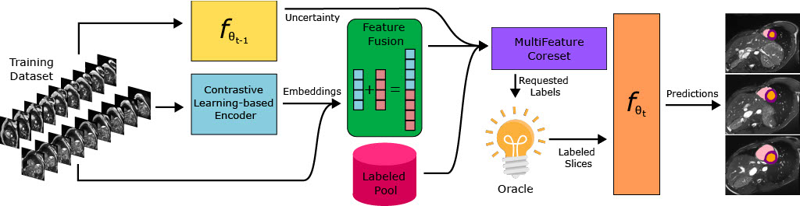

# CoreCLR: Active Learning in 3D Segmentation through Contrastive Learning

This is the official implementation for the paper "CoreCLR: Active Learning in 3D 
Segmentation through Contrastive Learning". CoreCLR trains a contrastive learning-based 
encoder with a unique Group-based Contrastive Learning (GCL) method which utilizes 
inherent data groupings specific to 3D medical segmentation to generate embeddings for 
all the slices in the dataset. MultiFeature Coreset (MFC) combines the slices' embeddings, 
raw pixel values, uncertainty values, along with previously labeled slices and scores the 
unlabeled slices. It then selects the optimal set of unlabeled slices which are used to 
train the segmentation model. A flow chart illustrating our pipeline can be seen below.



## Usage

Our code has been tested with Python 3.8 on Ubuntu 16.04 with a Tesla V100 GPU with CUDA 11.2.

1. Make sure `conda` or `virtualenv` is installed and create a virtual environment and install 
the libraries in `wsl4mis_requirements.txt`
```
pip install -r wsl4mis_requirements.txt
```
2. Set up the data (see `Data` section below)
3. Update the relevant parameters in `exp.yml` (see `Experiment Parameters` section below)
4. Run the Active Learning Experiment
```
python run_al_exp.py
```

## Data

In our work we used the [ACDC](https://www.creatis.insa-lyon.fr/Challenge/acdc/databases.html), 
[CHAOS](https://chaos.grand-challenge.org/), [MSC-MR](https://zmiclab.github.io/zxh/0/mscmrseg19/), 
and [DAVIS](https://davischallenge.org/) datasets. For all four datasets, we used essentially
the same pre-processing methods found [here](https://github.com/HiLab-git/WSL4MIS). The 
pre-processing code can also be found in the `wsl4mis` directory. Scribbles and pre-processed data 
for the ACDC dataset can be found [here](https://github.com/HiLab-git/WSL4MIS). Scribbles for the 
MSC-MR dataset can be found [here](https://github.com/BWGZK/CycleMix).

Please store the pre-processed data in a directory with the dataset name in `wsl4mis_data` 
as specified in `active_learning/dataset/data_params.py`. For example, the ACDC dataset should 
be in `wsl4mis_data/ACDC`. Please see the text files in `wsl4mis/data/dataset_name` for the 
subdirectory names corresponding to the train, val, and test sets.

## Experiment Parameters

There are four parameter groups in `exp.yml`: `model`, `data_geometry`, `model_uncertainty`, and 
`policy`. Additionally, at the same indent-level, you can specify a `exp_dir` which creates an 
experiment directory in the specified directory. Each of the parameter group parameters are 
passed directly to its respective factory. Thus, one can inspect the meaning of different 
parameters by looking at the constructors for each parameter group type (i.e. model, 
data_geomtry, model_uncertainty, and policy). 

Some of the important parameters in the `policy` section are:
- `policy_type`: In most cases this will be `ranked`, indicating to use a ranked selection method.
However, for random sampling, please use `random`.
- `rounds`: The proportion of the dataset to label in each round. This is a list of lists: the ith 
sublist indicates what proportion of the dataset to label in the ith round. Currently, only the first 
element of the sublist is used - the second should be set to zero. For example, if `rounds` is 
`[[0.1, 0], [0.1, 0], [0.1, 0], [0.1, 0]]`, then 10% of the dataset will be labeled for four rounds.

There are many other useful parameters, and we have provided several example yaml files. 
We have provided the yaml files for our method for the weakly-supervised and fully-supervised ACDC 
datasets. Additionally, we have provided yaml files for several baseline methods for all four 
datasets. To apply our method to the other datasets, simply update the `dataset` parameter in the
`model` section and `dataset_type` in the `data_geometry` section. Please look at the other yaml 
files as a guide.